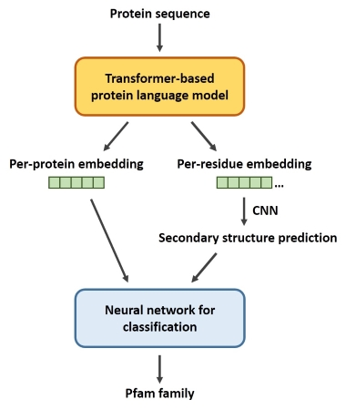

## Pfam family classifier ##

The aim of this notebook is to create a protein classifier that predicts the Pfam family of each protein based on its amino acid sequence.

### Dataset ###

[Pfam seed random split on Kaggle](https://www.kaggle.com/datasets/googleai/pfam-seed-random-split)

### Data analysis ###

**Observations**

* The Pfam database involves over a million samples and 17,929 protein family categories, bringing the Pfam classification task closer to extreme multi-label classification (XMLC).
* The protein family labels involved in the development and testing set are all included in the train set.
* The distribution of training instances among protein family labels exhibits a long tail (tail labels), suggesting that a large proportion of labels have a small number of instances (79% of labels have less than 100 training instances).

**Solutions**

* As there are only a few training instances in the tail labels, a pre-trained bidirectional Transformer for protein language representation could be a suitable solution as it can achieve good performance with fewer instances.

* Furthermore, attention-based Transformer models have been shown to capture features of connecting residues that are far apart in the underlying sequence but spatially close in the 3D structure (Vig et al., 2020), which makes it ideal for classifying protein families based on not only sequence similarity but also structural similarity.

* However, considering the limitation of computing power, only some protein families and related instances are selected for model demonstration. The selection criteria are as follows:

> 1. Keep the Pfam families included in all splits.
> 2. Pfam families with only a small number of training instances that may not be representative enough are temporarily ignored.
> 3. To avoid selection bias, we randomly sample a part of the Pfam families and check whether the selected ones were sufficiently representative (e.g., the sequence length distribution remains similar).
> 4. As pre-trained transformer models require fewer training instances, random undersampling is also used to reduce computational requirements.

### Method explanation ###

The classification of Pfam families is mainly based on sequence homology, and proteins from the same family also share similar structures and functions. However, as the sequence regions that constitute the main structure and function of proteins are relatively conserved, with the evolution of proteins, it may not be easy to detect only from the sequence similarity even when the protein structure and function similarity still exist. Therefore, in addition to the direct use of sequences for Pfam classification, It would also be interesting to use a higher-order structure prediction derived from sequences as another input for the classification task.

Due to the previous observation that there are fewer training instances for Pfam tail labels, pre-trained Transformer models are expected to reduce sample requirements by leveraging transfer learning. Meanwhile, attention-based Transformer models are better at capturing long-range dependencies, which is well suited for protein family classification as it relies not only on sequence similarity but also spatial structural similarity (Ofer et al., 2021).

### Experiment Description ###

Several Transformer-based models have been presented in recent years, including ESM (Rives et al., 2021), TAPE (Rao et al., 2019) and ProtTrans (Elnaggar et al., 2020), where the ProtTrans models are currently available in HuggingFace. Therefore, we adopt one of the ProtTrans models, encoder-only ProtT5-XL-UniRef50, which is suitable for amino-acid/protein embedding creation and feature extraction. The output vector representations will then be fed into the downstream network to complete the Pfam classification task. The encoder-only ProtT5-XL-UniRef50 model is accessible from here and its code demonstration can be found here.

The encoder-only ProtT5-XL-UniRef50 model also provides both global prediction (per-protein level) and local prediction (per-residue level). While global prediction outputs embeddings through average pooling over the entire protein sequence, in local prediction, per-residue embeddings are fed into a two-layer convolutional neural network (CNN) for secondary structure prediction. Therefore, two different protein structure information, primary sequence embedding and residue-based secondary structure prediction will serve as input to the downstream classification neural network.

The schematic of the experimental design:

### Result analysis ###

This experiment attempts to use sequences as model input and predict its Pfam family category. Considering the number of samples in most Pfam families is small, we use the pre-trained, Transformer-based protein language model for embedding prediction and the following classification task. Two levels of embedding predictions are employed, including sequence embedding that integrates information from the complete protein, and secondary structure prediction based on per-residue embeddings.

In the classification task based on global sequence embeddings, the pre-trained language model gives an impressive performance on embedding prediction and the Pfam classification task (F1-score of 0.97), considering it performs the 1000-family prediction task with only about 50 training instances per class.

However, the class prediction using the secondary structure prediction obtains an F1-score of 0.86, with additional dropout layers added to the downstream model to cope with overfitting. This is unsirprising, as we can see in t-SNE projection, global sequence embeddings produce more visually separable clusters in 2D space compared to secondary structure prediction, especially when the number of Pfam classes increases dramatically (from previous test results, data not shown). The reasons may be as follows:

1. The Transformer model's attention mechanism helps capture the dependencies of residues related to conserved motifs. As the global sequence embedding is derived from the average pooling of each residue embedding, it already contains protein spatial information

2. The output of secondary structure prediction is essentially like another set of sequences, except that the sequence composition is converted from amino acid residues to secondary structure abbreviations (alpha helices, beta sheets, and loops). Although the output result has simpler and clearer secondary structural information, it cannot keep leveraging transfer learning based on 45 million protein datasets in the subsequent classification task. It may require more data and a deeper downstream neural network.

Finally, as the diversity and representativeness of sequence training instances are considered during sampling, the selected samples have a sequence length distribution highly similar to before sampling. Therefore, if the number of Pfam labels is scaled up when the computing power allows, the proposed model is still expected to provide high performance on the Pfam classification task.

#### References ####
1. Elnaggar, A., Heinzinger, M., Dallago, C., Rihawi, G., Wang, Y., Jones, L., & Rost, B. (2020). ProtTrans: towards cracking the language of Life's code through self-supervised deep learning and high performance computing. arXiv preprint arXiv:2007.06225.
2. Ofer, D., Brandes, N., & Linial, M. (2021). The language of proteins: NLP, machine learning & protein sequences. Computational and Structural Biotechnology Journal, 19, 1750-1758.
3. Rao, R., Bhattacharya, N., Thomas, N., Duan, Y., Chen, P., Canny, J., & Song, Y. (2019). Evaluating protein transfer learning with TAPE. Advances in neural information processing systems, 32.
4. Rives, A., Meier, J., Sercu, T., Goyal, S., Lin, Z., Liu, J., & Fergus, R. (2021). Biological structure and function emerge from scaling unsupervised learning to 250 million protein sequences. Proceedings of the National Academy of Sciences, 118(15), e2016239118.
5. Rostlab/prot_t5_xl_half_uniref50-enc · Hugging Face https://huggingface.co/Rostlab/prot_t5_xl_half_uniref50-enc (Accessed on 20/10/2022).
6. Vig, J., Madani, A., Varshney, L. R., Xiong, C., Socher, R., & Rajani, N. F. (2020). BERTology meets biology: interpreting attention in protein language models. arXiv preprint arXiv:2006.15222.